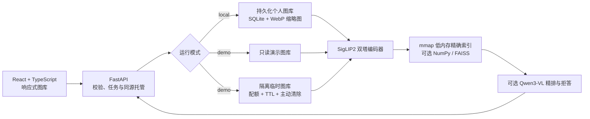

# MuseLens

[中文](README.md) | [English](README_EN.md)


[](https://sinbaby-muselens.ms.show)


[](LICENSE)

本地优先的多模态图片搜索与智能整理系统。用户导入自己的图片后，可以用中文或英文自然语言搜索，也可以上传一张图片查找视觉相似内容。浏览器只调用 MuseLens 自己的 FastAPI 服务，检索结果来自真实的 SigLIP2 向量编码和本地索引，并非关键词映射或第三方图库搜索。

**[在线体验](https://sinbaby-muselens.ms.show)** · **[系统架构](docs/ARCHITECTURE.md)** · **[实验结果](docs/BASELINE_RESULTS.md)** · **[面试讲解稿](docs/INTERVIEW_GUIDE.md)**

导入图片的副本默认保存在 `~/Pictures/MuseLensLibrary/` 专用目录，不移动、覆盖或删除用户原始照片。

## 30 秒验证

1. 打开在线体验，直接用 `dog`、`狗`、`a red car` 等中英文自然语言搜索固定演示图库。
2. 切换到临时图库，上传自己的几张图片，等待索引完成后输入与图片内容相关的任意关键词。
3. 搜索只发生在当前访客会话中；点击“立即清除”后，图片与索引都会删除，最长也只保留 30 分钟。

公开服务的 CI 不只检查页面能否打开：它会验证 8 条跨类别中英文查询，并创建真实临时图库完成上传、索引、检索、会话隔离和删除测试。最新一次线上证据见 [`modelscope-live-temporary-gallery-v1.json`](artifacts/evaluations/modelscope-live-temporary-gallery-v1.json)。

## 核心结果

| 场景 | 数据规模 | 结果 | 可复现证据 |
| --- | ---: | ---: | --- |
| 本地文本搜图 | 100 图 / 500 条英文查询 | Recall@1 **91.6%**，P95 **20.51 ms** | [本地端到端报告](docs/LOCAL_LIBRARY_E2E.md) |
| 中英文配对检索 | 100 图 / 各 30 条查询 | 英文 R@1 **100%**，中文 R@1 **96.67%** | [多语言报告](docs/MULTILINGUAL_RESULTS.md) |
| COCO 规模测试 | 5,000 图 / 5,000 次 HTTP 查询 | R@10 **77.82%**，平均 **18.31 ms** | [规模报告](docs/COCO_SCALE_RESULTS.md) |
| 以图搜图鲁棒性 | 500 图 / 2,500 张扰动图 | R@1 **99.36%**，R@5 **99.96%** | [以图搜图报告](docs/IMAGE_RETRIEVAL_RESULTS.md) |
| 公开图库 + VL 精排 | 44 条双语正例 / 10 条负例 | Top-1 **95.45%**，负例拒绝 **100%** | [精排报告](docs/PRECISION_RERANKING_RESULTS.md) |
| 5,000 图索引优化 | 1,000 查询 × 5 轮 | 纯索引加速 **10.87×**，排名一致率 **100%** | [索引基准](docs/INDEX_BENCHMARK.md) |

轻量 Adapter 确实完成了训练和消融，但没有超过冻结的 SigLIP2 基线，因此没有为了展示“训练成功”而上线。这个负结果、原始权重和决策过程同样保留在仓库中，详见[训练结果](docs/TRAINING_RESULTS.md)。

## 架构概览



### 工程亮点

- **完整数据闭环**：文件导入、SHA-256 去重、批量编码、SQLite 持久化、重启恢复、组合筛选和缩略图缓存。
- **可量化的模型决策**：比较 CLIP、SigLIP2 和轻量 Adapter；以独立测试集决定是否上线，而不是只展示训练 loss。
- **可解释的性能取舍**：默认使用磁盘映射精确检索；10 万个 768 维向量实测搜索后 RSS 从约 680 MB 降至 75 MB，同时保留 NumPy / FAISS 对照后端。
- **可纠正的自动整理**：复用图片向量进行零样本标签，不增加第二个模型；用户可在本地修正或恢复自动标签，人工结果在批量重建时受到保护。
- **安全的公开演示**：服务端强制只读固定图库；访客图库按会话隔离，限制文件数量、像素和容量，并自动过期。
- **可验证的交付**：React/Vite 与 FastAPI 单容器部署；GitHub Actions 发布到 ModelScope 后运行双语和真实上传质量门，未变更运行包时跳过昂贵重建。

## 技术栈

| 层 | 技术 |
| --- | --- |
| 前端 | React、TypeScript、Vite、响应式 CSS |
| API / 业务 | FastAPI、Pydantic、后台任务、同源静态托管 |
| 多模态检索 | PyTorch、Transformers、SigLIP2、可选 Qwen3-VL Reranker |
| 数据与索引 | SQLite WAL、NumPy mmap、可选 NumPy / FAISS、Pillow/WebP |
| 工程化 | Pytest、Ruff、ESLint、Docker、GitHub Actions、ModelScope Studio |

## 当前进度

- [x] 可安装的 Python 工程骨架
- [x] Apple Silicon MPS / CUDA / CPU 自动选择
- [x] CLIP / SigLIP2 通用延迟加载适配器
- [x] mmap 低内存向量索引与精确余弦检索
- [x] 图片导入、文本搜索、以图搜图 API 骨架
- [x] 不下载模型即可运行的基础测试
- [x] Flickr8k 100图/500查询的首个零样本检索基线
- [x] COCO 1000/5000 图真实 API 规模、资源与重启恢复基线
- [x] SQLite 图片元数据与向量持久化
- [x] SHA-256 去重与批量导入
- [x] 服务重启后自动恢复向量索引
- [x] mmap / NumPy / FAISS 统一精确索引后端
- [ ] 5 万图以上的 ANN/Qdrant 对比
- [x] 中英文检索基线、模型对比与安全向量迁移
- [x] 冻结主干的双塔残差 Adapter 与对称 InfoNCE 训练骨架
- [x] 5000/500/100 官方 split Adapter 训练、消融与最终测试
- [x] SHA-256 精确去重 + 感知哈希近似重复分组与安全清理
- [x] 受控词表零样本自动标签、持久化、重建与组合筛选
- [x] 本地人工标签纠正、来源标识、恢复自动与重建保护
- [x] 基于真实标签和封面动态生成的人物、萌宠、旅行、美食与自然智能相册
- [x] SQLite 持久化自定义相册、重命名、多相册收藏与不删除原图的安全移除
- [x] Recall@K、MRR 与编码延迟评测
- [x] React + TypeScript 响应式图片画廊前端
- [x] 语义 + 格式/方向/时间/尺寸的后端组合检索与响应式筛选面板
- [x] 查询内相关性分级、语义召回/文件名命中对比与非概率分数解释
- [x] 外部图片预览确认、图库内“查找相似”与临时会话隔离的以图搜图
- [x] COCO 500/2,500 查询以图搜图鲁棒性评测与独立阈值校准
- [x] 版本化 WebP 缩略图缓存与旧图片按需补建
- [x] SQLite 持久化后台索引任务、实时进度与失败重试
- [x] 无关查询拒答评测、校准/留出切分与阈值策略对比
- [x] 44 条中英文正例 + 10 条图库外查询的公开演示检索契约
- [x] SigLIP2 召回 + Qwen3-VL 精排的可选本地高精度模式
- [x] GitHub Actions CI
- [x] React/Vite + FastAPI 同源单容器部署骨架
- [x] 后端强制的本地完整模式 / 会话隔离的公开演示模式
- [x] 访客临时图库：限额上传、后台索引、30 分钟 TTL 与主动清除
- [x] 24 张 CC BY 2.0 署名演示语料、预计算索引与容器冷启动优化
- [x] Cloud Run 无长期密钥部署工作流、成本边界与线上冒烟测试
- [x] ModelScope Studio Docker 部署配置（国内公开演示候选）
- [x] ModelScope 强制只读配置与跨类别中英文线上验收合同
- [x] GitHub → ModelScope 最小发布包、令牌推送、OpenAPI 部署与自动验收工作流
- [x] 公开 ModelScope Studio 地址与自动化线上验收
- [ ] 录制 60 秒产品演示视频

## 快速开始

```bash
cd /Users/joyboy/Desktop/AI-Engineering-Portfolio/MuseLens
python3 -m venv .venv
source .venv/bin/activate
python -m pip install -e '.[dev]'
pytest
```

开发时启动 API：

```bash
uvicorn muselens.api:app --reload
```

打开 <http://127.0.0.1:8000/docs>，可在交互式文档中测试接口。

需要更可靠的中英文排序和“图库中没有该内容”判定时，可启用本地高精度模式：

```bash
python -m pip install -e '.[dev,precision]'
MUSELENS_RERANKER_MODEL=Qwen/Qwen3-VL-Reranker-2B \
  uvicorn muselens.api:app
```

首次使用会下载约 4.27 GB 的 Qwen3-VL-Reranker-2B。该模式先用 SigLIP2 召回 5 张候选，
再逐张精排并以 0.40 阈值拒绝弱匹配；适合 M4 16 GB 本地运行，不作为免费 CPU 演示的默认项。

另开一个终端启动 Vite 前端：

```bash
cd frontend
npm install
npm run dev
```

浏览器访问 <http://localhost:3000>。界面支持文件夹批量导入、语义与图片属性组合检索、
可移除筛选标签、瀑布流结果、检索耗时、匹配度展示和图片灯箱预览。

也可以使用统一命令：

```bash
make install
make lint
make test
```

实验结束后可运行 `make storage` 预览可释放空间；确认后使用 `make clean-generated`。需要连同
可重建的特征向量缓存一起清理时，使用 `make clean-feature-cache`。删除范围限定在 MuseLens
项目内，评测报告、训练权重、模型、虚拟环境和前端依赖都会保留。

Vite 会在开发环境把 `/health` 和 `/v1` 转发到本地 API。生产构建由 FastAPI
同源托管，不再需要额外配置 CORS 或前端 API 地址。

配置项示例见 `.env.example`。`local` 模式没有认证层，只应绑定本机地址；公开部署必须
使用 `demo` 模式。演示模式禁止修改固定图库，但允许访客建立相互隔离的临时图库：默认
最多 30 张、单张 8 MB、合计 120 MB，并在最后完成索引 30 分钟后自动删除。页面也提供
“立即清除”按钮。临时会话不是账户系统，不适合保存长期或敏感内容。

## Docker

```bash
docker build -t muselens .
docker run --rm -p 7860:7860 \
  -v muselens-data:/data \
  -e MUSELENS_MODE=local \
  muselens
```

访问 <http://localhost:7860>。Docker 使用多阶段构建：Node 只负责生成静态前端，最终由
一个 FastAPI 容器同时提供页面、API、图片和模型推理。

国内公开演示优先使用 ModelScope Studio Docker 模式：根目录 `ms_deploy.json` 已声明
2 核 CPU / 16 GB 内存、7860 端口以及强制只读 `demo` 模式，直接复用同一个 Dockerfile。账号注册和发布验收步骤
见 `docs/MODELSCOPE_DEPLOYMENT.md`。

`.github/workflows/deploy-modelscope.yml` 可以从 `main` 生成不含训练数据和本地状态的最小
发布包，推送到 ModelScope Studio、调用 OpenAPI 触发部署，并在提供公开 URL 时等待冷启动
完成后自动运行中英文质量门。访问令牌只保存在 GitHub Environment Secret
`MODELSCOPE_API_TOKEN` 中。

部署成功后不再用单个 `dog` 查询作为验收依据。快速合同会覆盖 4 类内容的 8 条中英文
查询，并要求 Hit@5 不低于 90%；完整合同运行全部 44 条正例和 10 条图库外查询：

```bash
python scripts/smoke_deployment.py https://你的地址 --contract quick
python scripts/evaluate_demo_search.py https://你的地址 \
  --output artifacts/evaluations/public-demo-v1.json
```

Cloud Run 作为有国际支付方式时的备选，使用 `.github/workflows/deploy-cloud-run.yml`：GitHub Actions 通过
Workload Identity Federation 获取短期 Google 凭据，从当前 `main` 构建同一个 Dockerfile，
并以 2 GiB、最小实例 0、最大实例 1、并发 1 的边界部署。部署后会自动验证只读 demo
模式、固定索引和真实文本检索。一次性账号配置见 `docs/CLOUD_RUN_DEPLOYMENT.md`。

Hugging Face 发布器仍作为可选路径保留；它会调用 `scripts/package_space.py` 生成干净的
发布树，不维护第二份源码。是否能创建 Docker Space 取决于账号当时的订阅与平台配额。

运行可复现的文本搜图基线：

```bash
python scripts/download_evaluation_sample.py --count 100
python scripts/evaluate_retrieval.py --batch-size 16
python scripts/evaluate_rejection.py
python scripts/evaluate_gallery_smoke.py
python scripts/evaluate_image_retrieval.py --count 500 --batch-size 16
python scripts/evaluate_duplicates.py
```

首个小样本结果：Recall@1 0.852、Recall@5 0.976、Recall@10 0.998、MRR 0.908。候选集只有100张图片，因此这只是工程基线，不代表最终系统效果。详见 `docs/BASELINE_RESULTS.md`。

中英文成对查询实验中，默认模型升级为 SigLIP2：中文 Recall@1 从 3.3% 提升到 96.7%，英文 Recall@1 为 100%。模型切换同时包含向量隔离、安全重建和拒答阈值再校准。详见 `docs/MULTILINGUAL_RESULTS.md`。

轻量 Adapter 在5000张训练图上完成真实训练与消融，但最终英文收益可以忽略，中文 Recall@1 反而下降3.4个百分点，因此没有为了展示“训练成功”而上线。完整结果和决策见 `docs/TRAINING_RESULTS.md`。

无关查询拒答实验中，留出集综合分数由 0.923 提升到 0.974；动态 z-score 未超过校准固定阈值，因此没有为了复杂度强行上线。详见 `docs/REJECTION_RESULTS.md`。

公开演示新增 44 条中英文图库内查询和 10 条图库外查询。轻量 SigLIP2 的 Top-1 为
75.0%、Top-5 为 97.73%，但图库外拒绝率为 0%；加入 Qwen3-VL 精排后，无阈值 Top-1
升至 95.45%、Top-5 为 100%，采用 0.40 阈值时图库内命中率为 93.18%、图库外拒绝率为
100%。完整协议、失败案例和适用边界见 `docs/PRECISION_RERANKING_RESULTS.md`。

临时图库另有 8 张混合图片、12 条中英文短词的端到端搜索契约测试。当前 SigLIP2
Top-1 为 12/12；该测试专门防止“索引成功但搜索返回空页”的回归。

真实本地模式已完成 100 张图片的导入、去重、HTTP 检索与服务重启恢复验证。500 条英文
查询 Recall@1 为 91.6%，30 条中文查询 Recall@1 为 96.67%，检索空结果率均为 0%。详见
`docs/LOCAL_LIBRARY_E2E.md`。

COCO 2017 全部 5000 张验证图片已完成真实后台导入和 5000 条 HTTP 查询。Recall@1 为
45.56%、Recall@10 为 77.82%，平均延迟 51.40 ms，重启后恢复 5000/5000 张。规模测试
证明当前线性索引可用，也量化了引入矩阵化/FAISS 索引的必要性。详见
`docs/COCO_SCALE_RESULTS.md`。

索引已从 Python 逐向量循环升级为连续 NumPy 矩阵：5000 图纯索引平均延迟由 3.94 ms
降至 0.363 ms，真实 HTTP 平均热查询由 51.40 ms 降至 18.31 ms，Top-10 排名和 Recall
保持不变。FAISS 更快但在 M4 的 pip PyTorch 同进程中存在 OpenMP 冲突，因此没有盲目设为
默认。详见 `docs/INDEX_BENCHMARK.md`。

随后增加磁盘映射精确索引作为默认后端。10 万个 768 维向量的独立进程测试中，首次搜索后
RSS 从 NumPy 的约 680 MB 降到 mmap 的约 75 MB；连续向量存入约 293 MB 的临时缓存文件，
服务退出时自动删除，SQLite 仍是唯一数据源。可使用 `python scripts/benchmark_index_memory.py --backend mmap`
复现实验。

以图搜图已完成 500 张图库原图、2,500 张扰动查询的真实 MPS 评测：Recall@1 为
99.36%，Recall@5 为 99.96%。图片搜索相对分差据此从 0.035 独立校准为 0.05；完整
协议、分扰动结果和适用边界见 `docs/IMAGE_RETRIEVAL_RESULTS.md`。

近似重复检测使用 64 位感知哈希与归一化平均色彩约束。在同一批 500 张 COCO 原图和
2,500 张扰动图上，JPEG 强压缩、模糊、曝光变暗和低分辨率四类直接召回均为 100%，
跨原图误组为 0；68% 中心裁剪未命中并作为当前严格模式边界。详见
`docs/DUPLICATE_DETECTION_RESULTS.md`。

自动标签复用已经生成的 SigLIP2 图片向量，不重复读取或编码原图。24 张公开演示图全部生成
1～3 个受控标签；与 COCO 可精确对齐的对象标签精确率为 84.6%，16/24 图片至少命中一个
真实对象。系统选择精确率优先，并明确保留多对象召回率较低的边界。详见
`docs/AUTO_TAGS_RESULTS.md`。本地模式还可在图片灯箱中修正标签，并区分“自动”和“人工”来源；
普通批量重建和模型迁移不会覆盖人工结果，只有用户主动选择“恢复自动”才会重新推断。

## 接口

- `GET /health`：服务、模型、索引、运行模式和图库写入能力
- `GET /v1/images`：已索引图片
- `GET /v1/duplicates`：按感知指纹读取近似重复图片组与预计可释放空间
- `GET /v1/tags/catalog`：读取可供筛选和人工修正的受控标签目录
- `GET/POST /v1/albums`：读取或创建本地自定义相册
- `PUT/DELETE /v1/albums/{album_id}`：重命名或安全删除相册（不删除原图）
- `PUT /v1/albums/{album_id}/images`：添加或移除相册中的图片引用
- `PUT /v1/images/{image_id}/tags`：保存人工标签（仅本地模式）
- `POST /v1/images/{image_id}/tags/auto`：恢复单张图片的自动标签（仅本地模式）
- `POST /v1/tags/rebuild`：使用已持久化图片向量重建非人工标签（仅本地模式）
- `DELETE /v1/images/{image_id}`：仅在本地模式删除 MuseLens 导入副本
- `GET /v1/images/{image_id}/content`：读取原图
- `GET /v1/images/{image_id}/thumbnail`：读取或按需生成缓存缩略图
- `POST /v1/images`：导入图片并生成向量
- `POST /v1/images/batch`：批量导入、批量编码并自动去重
- `POST /v1/import-jobs`：创建持久化后台导入任务
- `GET /v1/import-jobs/latest`：恢复最近一次任务状态
- `GET /v1/import-jobs/{job_id}`：查询任务进度
- `POST /v1/import-jobs/{job_id}/retry`：重试失败文件
- `POST /v1/search/text`：文本与格式、方向、尺寸、时间、排序的组合检索；查询文本可留空
- `POST /v1/search/image`：以图搜图，并排除图库中的完全相同文件
- `POST /v1/demo/sessions`：上传图片并创建隔离的临时图库
- `GET /v1/demo/sessions/{session_id}`：读取临时索引进度和到期时间
- `GET /v1/demo/sessions/{session_id}/images`：读取本会话图片
- `GET /v1/demo/sessions/{session_id}/duplicates`：检查本会话的近似重复图片组
- `POST /v1/demo/sessions/{session_id}/search/text`：只搜索本会话图片
- `POST /v1/demo/sessions/{session_id}/search/image`：在本会话内以图搜图
- `DELETE /v1/demo/sessions/{session_id}`：立即清除临时图库

## 学习方式

从 `docs/DAY_01.md` 开始。每完成一个模块，在 `docs/LEARNING_LOG.md` 中回答“用途、原理、替代方案、验证方法”四个问题。详细路线见 `docs/PROJECT_PLAN.md`。

系统分层见 `docs/ARCHITECTURE.md`，开源项目调研、许可证边界和功能决策见 `docs/OPEN_SOURCE_RESEARCH.md`。

高收藏图文检索项目的训练规模对比，以及针对 M4 16 GB 的取舍见 `docs/GITHUB_TRAINING_RESEARCH.md`。

本轮可靠性、安全、依赖和 GitHub 准备审计见 `docs/ENGINEERING_AUDIT.md`。项目采用 MIT 许可证；贡献和安全报告方式分别见 `CONTRIBUTING.md` 与 `SECURITY.md`。
