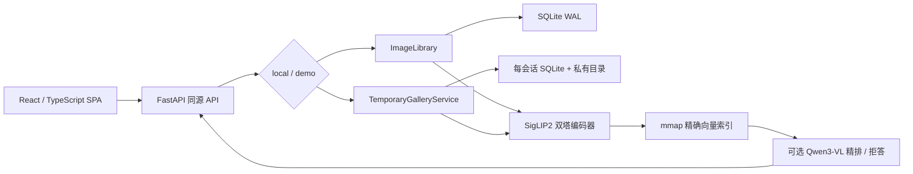

# MuseLens v0.1.0 系统设计

## 1. 设计目标

在单机、本地优先的约束下，提供可持久化、可恢复、可评测的多模态图片检索；同时让同一
代码库以受限 `demo` 模式公开部署。优先级依次是数据安全、结果正确、可解释与可维护，
然后才是极限吞吐。

## 2. 组件与数据流

主要代码边界：

- `api.py`：HTTP 契约、输入校验、运行模式权限、同源资源；
- `library.py`：导入、去重、编码、持久化与业务编排；
- `repository.py`：SQLite 状态、WAL、外键、启动恢复；
- `index.py`：mmap / NumPy / FAISS 统一精确索引；
- `encoder.py`：模型延迟加载、设备选择、图文编码；
- `sessions.py`：临时会话、配额、全局编码队列、TTL；
- `jobs.py`：可持久化后台索引任务与失败重试；
- `duplicates.py`、`tags.py`：近似重复和零样本标签；
- `reranker.py`：可选两阶段精排与阈值拒答。

## 3. 写入路径

本地导入：

1. API 校验路径/请求并创建持久化任务；
2. 图片经大小、像素和 Pillow 解码检查；
3. SHA-256 判断精确重复；
4. 副本先写临时文件，再原子替换到专用图库；生成 WebP 缩略图；
5. SigLIP2 批量编码，SQLite 保存元数据和向量来源；
6. 更新可重建 mmap 缓存；任务完成或将错误保存为可重试状态。

原始照片不被移动、覆盖或删除。自定义相册保存图片引用，删除相册不删除图片。自动标签
可人工纠正，批量重建保护人工来源。

## 4. 查询路径与算法

文本查询经 tokenizer 和文本塔得到向量；图片查询经预处理和视觉塔得到向量。图库向量与
查询向量 L2 归一化后计算：

`score(q, x) = q · x = cosine(q, x)`

精确索引分块扫描 mmap 文件，选出 Top-K，再应用稳定排序和元数据过滤。时间复杂度 O(Nd)，
其中 N 为图片数、d=768；额外常驻内存受分块大小控制。可选高精度模式先由 SigLIP2 召回
最多 5 张，再由 Qwen3-VL 对“原始查询 + 候选原图”逐一精排。

注意：双塔分数用于相对排序，不是校准概率。轻量模式的正负分数重叠，因此不保证拒答。

## 5. 状态与一致性

SQLite 是业务数据源，mmap 是可重建派生缓存。启动时若缓存丢失或不匹配，系统从 SQLite
流式恢复，避免把不可恢复状态只放在内存。SQLite 使用 WAL、外键、30 秒 busy timeout 和
`NORMAL` synchronous。写图片采用临时文件 + 原子替换，并在异常路径清理原图副本和缩略图。

后台任务会持久化状态；工作器顶层异常被捕获，避免任务永久停留在 `running`。

## 6. 安全与隐私边界

- `demo` 模式由服务端拒绝固定图库写接口，而非只隐藏按钮；
- 临时会话 ID 为 128-bit 随机值，每会话独立目录、数据库和索引；
- 默认最多 30 图、单图 8 MB、合计 120 MB、最多 8 个活动会话；
- 设 4,000 万解码像素上限，图片须通过 MIME、大小和 Pillow 解码检查；
- 临时图片响应为 `private, no-store`；
- 一个全局串行编码队列限制免费 CPU 实例的模型并发；
- 完成索引 30 分钟后过期，也可主动清除。

会话 ID 不是账户认证。公网生产化仍需入口级请求限制、速率限制、真实身份、对象存储权限
和删除审计。

## 7. 性能设计

逐向量 Python 点积在 5,000 图平均 3.942 ms；连续 NumPy 矩阵为 0.363 ms，FAISS FlatIP
为 0.237 ms。默认 mmap 的主要目的不是宣称比 FAISS 快，而是减少常驻内存：100k × 768
合成向量单次搜索后 RSS 从 NumPy 的 679.8 MB 降为 74.7 MB，代价是 293 MB 缓存文件和
仍然线性的扫描。

端到端延迟还包含 HTTP、文本编码、过滤与序列化，不能用纯索引数字代替用户延迟。

## 8. 部署与故障恢复

Docker 多阶段构建：Node 只构建 SPA；最终 CPU 容器由 FastAPI 在 7860 端口提供全部能力。
ModelScope 配置显式设置 `MUSELENS_MODE=demo`，避免环境推断错误。GitHub Actions 生成不含
训练数据/本地状态的最小包，推送、触发部署、等待健康，再执行双语和临时图库质量门。

临时访客数据不做重启恢复；这是隐私和简化取舍。固定/本地图库由 SQLite 与缓存恢复。

## 9. 扩展触发条件

只有实测出现以下信号才升级架构：

- 精确扫描 P95 超出产品预算：比较 HNSW/IVF 的召回损失与构建成本；
- 单进程编码成为吞吐瓶颈：拆分模型服务并加入有界队列/背压；
- 多实例部署：把 SQLite/本地目录替换为共享元数据与对象存储，并定义一致性；
- 多用户长期存储：先补认证、授权、配额和删除语义，再谈横向扩展。

