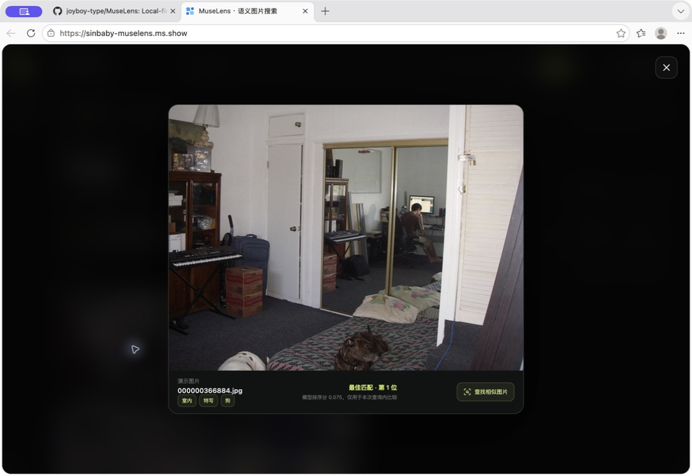
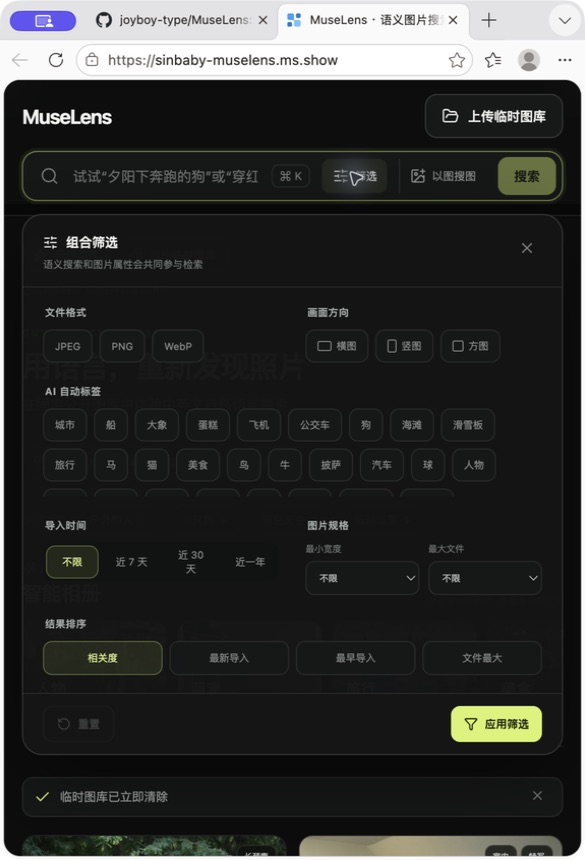

# MuseLens v0.1.2 最终展示与回归验收

> 展示验收日期：2026-07-25；v0.1.2 回归日期：2026-07-26（Asia/Shanghai）
> 验收对象：<https://sinbaby-muselens.ms.show>  
> 结论：**通过**

## 验收结论

MuseLens 的公开固定图库、结果预览、临时图库、会话清理和窄窗口筛选界面均完成真实验收。
唯一发现的产品问题是移动端筛选操作文案仍为“重置”；该问题已在 v0.1.1 更正为
“重置筛选”，并增加生产构建回归断言。

发布复验还发现，旧的部署等待逻辑可能在 ModelScope 新镜像仍处于 `Building` 时读取到旧容器
的健康响应并提前通过。v0.1.1 在 `/health` 中增加应用版本，并要求部署门禁等待线上版本与
目标版本完全一致后再执行检索验收。

Computer Use 在 macOS 系统文件选择器中无法稳定完成三文件多选，因此 UI 路径只完成了
单图上传验证。独立的线上部署验收脚本已真实上传三张不同类别图片并完成索引、六条中英文
查询、会话隔离与清理，证明产品的多文件链路正常。这一差异属于自动化工具限制，不记为
MuseLens 产品缺陷。

v0.1.2 在不改变模型和部署架构的前提下补充三项正确性修复：带元数据筛选的文本检索会在
候选不足时突破原 Top 100 截断；并发导入相同 SHA-256 时返回同一数据库记录并清理冗余文件；
`imported_after` 强制携带时区，筛选和时间排序统一按 UTC。完整后端回归 90 passed、
1 skipped；针对性套件 27 passed，并发用例重复 10 次全部通过。

## 界面验收

| 项目 | 结果 | 观察 |
| --- | --- | --- |
| 首屏与服务状态 | 通过 | 显示“公开演示在线”、24 张已索引，缩略图完整 |
| `dog` | 通过 | 狗图排名第 1 |
| `狗` | 通过 | 同一狗图排名第 2 |
| `a red car` | 通过 | 含汽车场景排名第 1 |
| `披萨` | 通过 | 前两位为美食场景，公开语料确认包含 pizza |
| 结果预览 | 通过 | 大图、AI 标签、名次、模型排序分和相似图片入口可见 |
| 临时图库单图链路 | 通过 | 上传、索引、`dog` / `狗` 检索和立即清除成功 |
| 临时图库三图 UI 多选 | 工具受限 | macOS 文件选择器无法被 Computer Use 稳定多选 |
| 窄窗口筛选布局 | 通过 | 无横向溢出，底部操作区可见 |
| 筛选重置文案 | 修复后通过 | v0.1.1 统一为“重置筛选” |

### 结果预览

### 窄窗口筛选面板

## 自动化线上验收

### 固定图库完整双语契约

- 查询数：84（英文 42、中文 42）
- Hit@1：72.62%
- Hit@5：95.24%
- 英文 Hit@5：97.62%
- 中文 Hit@5：92.86%
- 空结果率：0%
- 固定图库写入保护：HTTP 403

机器可读证据：
[`final-acceptance-v0.1.1-fixed-gallery.json`](../artifacts/evaluations/final-acceptance-v0.1.1-fixed-gallery.json)

### 临时图库完整链路

- 真实上传：3 张不同类别图片
- 中英文查询：6 条
- 图片内容缓存：`private, no-store`
- 会话隔离：未知会话返回 HTTP 404
- 主动清理：成功，清理后会话返回 HTTP 404

机器可读证据：
[`final-acceptance-v0.1.1-temporary-gallery.json`](../artifacts/evaluations/final-acceptance-v0.1.1-temporary-gallery.json)

## v0.1.1 版本判定（历史）

本次变更不改变模型、索引、API 或数据协议，属于展示文案修复与验收证据归档，因此按照语义化
版本规则发布为 `v0.1.1`，而不是新增次版本。

## v0.1.2 补丁判定

本次修改不改变模型、存储格式或主要 API 路径，但修复了大图库筛选召回、并发唯一性冲突和
跨时区筛选的可触发错误，因此按照语义化版本发布为 `v0.1.2`。
