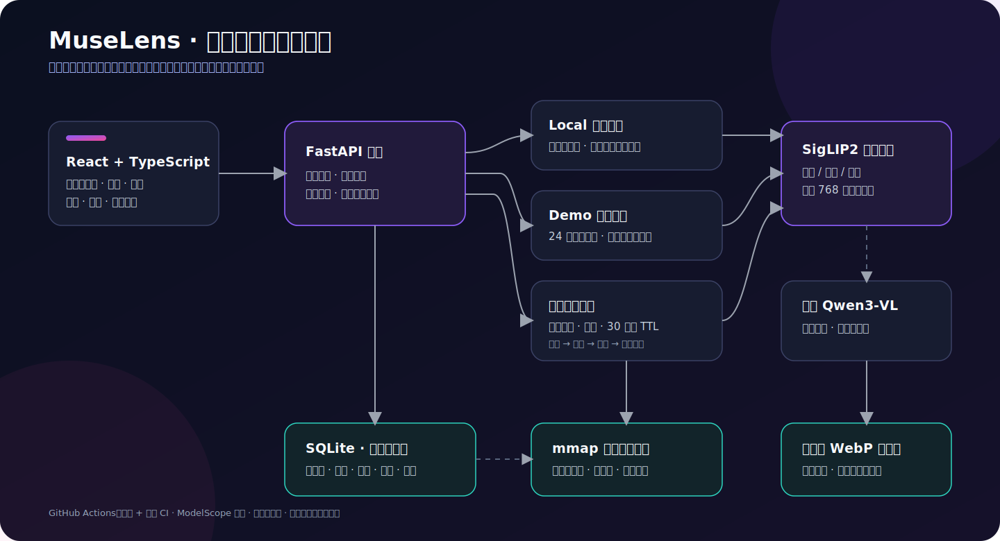

# MuseLens 项目作品集

> 一个可以真正上传个人图片验证的本地优先多模态检索系统，而不是固定关键词演示页面。

**在线体验：** <https://sinbaby-muselens.ms.show>  
**源码仓库：** <https://github.com/joyboy-type/MuseLens>  
**技术栈：** React · TypeScript · FastAPI · PyTorch · SigLIP2 · SQLite · NumPy mmap · Docker

## 我解决了什么问题

普通文件名搜索无法理解图片内容，很多 AI 图片检索 Demo 又只展示固定图库，无法证明上传、
索引、检索和数据清理链路真实存在。MuseLens 同时提供三种运行场景：

1. **个人本地图库**：持久化导入自己的图片，支持中英文文本搜图、以图搜图、标签纠正和相册。
2. **公开固定图库**：使用可追溯授权的图片，服务端强制只读，便于快速体验。
3. **访客临时图库**：任何人都可上传自己的图片验证检索；数据按会话隔离，并在 30 分钟后清理。

## 可以量化的结果

| 能力 | 评测协议 | 结果 |
| --- | --- | ---: |
| 线上中英文检索 | 24 图，84 条自然语言查询 | Hit@5 **95.24%** |
| 本地文本搜图 | 100 图，500 条英文查询 | Recall@1 **91.6%** |
| 中英文配对检索 | 100 图，各 30 条查询 | 英文 R@1 **100%**；中文 R@1 **96.67%** |
| 以图搜图 | 500 图，2,500 张扰动查询 | Recall@1 **99.36%** |
| 检索优化 | 5,000 图，1,000 查询 × 5 轮 | 纯索引加速 **10.87×** |
| 低内存索引 | 100,000 个 768 维向量 | 搜索后 RSS 降低 **89.0%** |

最新线上机器可读证据：

- [84 条中英文完整合同](../artifacts/evaluations/modelscope-live-bilingual-v2.json)
- [真实上传、索引、检索与删除合同](../artifacts/evaluations/modelscope-live-temporary-gallery-v2.json)
- [10 万向量内存对比](../artifacts/evaluations/vector-index-memory-100k-v1.json)

## 最有价值的工程决策

### 1. 用端到端合同证明后端不是“只有外壳”

部署验收会真实创建临时会话、上传 dog/car/pizza 图片、等待模型索引，再分别用中英文查询。
测试同时验证未知会话返回 404、图片响应禁止公共缓存，以及清理后资源确实消失。

### 2. 不把相似度包装成虚假的置信概率

免费 CPU 演示使用 SigLIP2 进行排序。由于正负查询最高分区间重叠，界面只展示查询内相对
相关性，不承诺绝对概率。需要严格拒答时使用独立评测过的可选 Qwen3-VL 精排器。

### 3. 根据实验决定是否上线训练模型

项目完成了 5,000 张训练图上的轻量 Adapter 消融，但独立测试未超过冻结 SigLIP2 基线，
中文 Recall@1 还下降了 3.4 个百分点。因此保留训练代码、权重和负结果，但不把它部署到
生产路径中。

### 4. 以接口保留扩展能力，不提前堆叠复杂基础设施

5,000 图下 NumPy 矩阵检索已经足够；默认 mmap 后端进一步减少常驻内存。FAISS 作为可选
对照实现保留，等数据证明线性扫描成为瓶颈后，再引入 ANN 或独立向量服务。

## 60 秒演示顺序

1. 在固定图库输入 `狗`，展示中文语义检索。
2. 输入 `a person holding a mobile phone`，展示长句检索与相关性解释。
3. 切换临时图库，上传三张任意图片并等待索引。
4. 用与文件名无关的中文或英文描述找到其中一张图片。
5. 点击立即清除，说明会话隔离、TTL 和隐私边界。
6. 展示 GitHub CI 与评测表，证明效果来自可复现合同。

完整旁白和镜头安排见[演示录制脚本](DEMO_SCRIPT.md)。

## 简历可直接采用的描述

- 独立实现本地优先的多模态图片检索系统，使用 React/TypeScript、FastAPI、PyTorch、
  SigLIP2 与 SQLite，支持中英文文本搜图、以图搜图、后台导入、去重与重启恢复。
- 将 5,000 图精确向量检索由 Python 逐向量计算优化为连续矩阵运算，平均延迟由
  3.942 ms 降至 0.363 ms，Top-10 排名保持 100% 一致。
- 设计会话隔离、资源配额和 TTL 清理的访客临时图库，并以 GitHub Actions 建立
  上传—索引—双语检索—删除的线上质量门；84 条双语查询 Hit@5 达 95.24%。

## 当前边界

- 免费公开实例是 CPU 环境，不默认运行 2B 参数的 VL 精排器。
- 临时图库没有账户系统，不适合长期保存或上传敏感图片。
- 公开固定图库只有 24 张，展示指标不能代替 COCO/Flickr8k 独立评测。
- 当前已验证 5,000 图真实 API 和 10 万向量内存基准，不能声称支持百万级生产图库。

