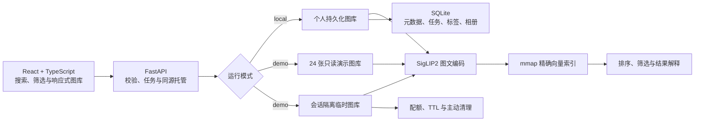

# 我做了一个真正能上传个人图片验证的多模态检索系统：MuseLens 从 Demo 到可交付项目

> 项目版本：v0.1.1  
> 在线体验：<https://sinbaby-muselens.ms.show>  
> GitHub：<https://github.com/joyboy-type/MuseLens>

很多“AI 图片搜索”项目看起来很完整：输入 `dog`，页面返回几张狗的图片。但如果图库是提前
准备好的，查询词也是固定的，我们仍然无法确认它究竟完成了真实的图文检索，还是只做了一层
演示外壳。

我在 MuseLens 中想解决的并不是“再做一个图片瀑布流”，而是把下面这条链路真正打通：

```text
用户图片 → 安全导入 → 图像编码 → 向量持久化 → 中英文检索
        → 结果解释 → 会话隔离 → 数据清理 → 自动化线上验收
```

MuseLens 最终成为了一个本地优先的多模态图片检索与整理系统：用户可以导入自己的图片，用
中文、英文或另一张图片进行搜索；本地模式还支持去重、自动标签、人工纠正、智能相册和自定义
相册。公开演示允许访客建立临时图库，亲自上传图片验证后端能力，而不是只能搜索项目自带的
固定样例。

这篇文章不只介绍最终效果，也会记录其中几次重要的失败与取舍：为什么从 CLIP 切换到
SigLIP2、为什么训练了 Adapter 却没有上线、为什么没有急着引入向量数据库，以及如何避免
“新版本还在构建，旧服务却让部署检查提前通过”。

## 一、先定义什么叫“真的做完”

项目早期最容易满足的是页面效果，最难证明的是数据闭环。一次上传接口返回成功，并不代表：

- 图片真的完成了编码和索引；
- 文本搜索会进入当前用户的图库；
- 中文和英文都能召回目标；
- 不同访客无法读取彼此图片；
- 用户清理后，文件和会话真的消失；
- 云端部署的代码与刚提交的版本一致。

因此，我把 MuseLens 拆成三个明确的使用场景：

1. **个人本地图库**：持久化保存导入副本、元数据和向量，适合整理自己的照片。
2. **公开固定图库**：使用 24 张带授权说明的演示图片，服务端强制只读，方便快速体验。
3. **访客临时图库**：任何访客都能上传自己的图片，数据按随机会话隔离，支持主动清理，并在
   索引完成 30 分钟后自动过期。

公开服务没有账户系统，因此临时图库不适合保存长期或敏感数据。这不是藏在用户协议里的小字，
而是产品边界：临时图库的目标是让用户验证检索能力，不是充当云相册。

## 二、整体架构：一个模型，三种运行场景

前端使用 React、TypeScript 和 Vite，后端使用 FastAPI。生产环境中，FastAPI 同源托管
Vite 的静态产物、API、图片和模型推理，因此部署时只需要一个容器，也不需要维护两套跨域
配置。



后端的主要职责并不只是“调用一次模型”：

- 导入时计算 SHA-256，跳过完全相同的文件；
- 使用感知哈希和平均色彩辅助识别缩放、压缩等近似副本；
- 分批生成图像向量和最长边 640px 的 WebP 缩略图；
- 在 SQLite 中持久化图片元数据、后台任务、标签和相册关系；
- 使用可重建的 mmap 缓存执行低内存精确向量检索；
- 重启后从持久化数据恢复索引，不重新编码全部图片；
- 公开模式由服务端拒绝固定图库写操作，不能靠隐藏前端按钮“假只读”。

自动标签也没有再加载第二个视觉模型。它复用 SigLIP2 图片向量，与受控的中英文标签文本向量
比较；本地用户可以纠正标签，人工结果会被标记为 `manual`，后续批量重建不会覆盖。自定义
相册只保存图片 ID 引用，删除相册不会删除原图。

## 三、模型选择不是看热度，而是跑同一个协议

最初的 CLIP ViT-B/32 可以完成英文搜索，但中文效果不足。在固定的 100 张 Flickr8k 图片和
30 组中英配对查询上，我用相同协议比较了 CLIP 与 SigLIP2：

| 模型 | 英文 Recall@1 | 中文 Recall@1 | 中文 Recall@5 |
| --- | ---: | ---: | ---: |
| CLIP ViT-B/32 | 93.3% | 3.3% | 6.7% |
| SigLIP2 Base P16 224 | 100% | 96.7% | 100% |

因此，默认模型切换为 `google/siglip2-base-patch16-224`。切换模型不只是改一个配置字符串：
旧向量和新向量不能混用，系统恢复索引时会核对 `model_id`；重建脚本先完成全部编码，再在
同一个 SQLite 事务中替换向量，避免半成品状态。

这组数据用于项目内部选型，不是通用学术结论。候选集只有 100 张，中文查询也由项目人工整理，
所以我没有把 96.7% 写成“中文图片检索准确率”。

完整协议见[中英文检索模型对比](MULTILINGUAL_RESULTS.md)。

## 四、我确实训练了模型，但最终决定不用

为了验证小规模领域适配是否有价值，我冻结了 SigLIP2 的图像塔和文本塔，训练两个
`768 → bottleneck → 768` 的残差 Adapter。数据按图片划分：

- Flickr8k train：5,000 张图片、25,000 条英文描述；
- validation：500 张图片、2,500 条描述，用于选配置和早停；
- test：100 张图片、500 条英文描述，只用于最终测试；
- 另用 30 组中英文查询检查多语言能力。

最佳配置在 validation 上确实有小幅提升，但锁定检查点后，最终 test 的结果是：

| 指标 | 原始 SigLIP2 | Adapter | 变化 |
| --- | ---: | ---: | ---: |
| 英文 Recall@1 | 91.6% | 91.6% | 0 |
| 英文 MRR | 0.95071 | 0.95097 | +0.00026 |
| 中文 Recall@1 | 96.7% | 93.3% | -3.4 个百分点 |

训练 loss 下降，不等于检索系统变好。英文收益没有产品意义，中文能力反而下降，因此线上继续
使用冻结的 SigLIP2。训练代码、最佳权重、消融记录和负结果都保留在仓库中，但不把“训练过”
包装成“模型升级成功”。

这次失败反而明确了下一次实验需要什么：加入与图片对应的多语言描述，并把中文指标放进模型
选择目标，而不是只在英文训练结束后做一次检查。

完整结果见[Adapter 训练报告](TRAINING_RESULTS.md)。

## 五、为什么 5,000 张图时没有直接上向量数据库

MuseLens 最早的索引实现用 Python 字典逐个计算向量点积。它容易理解，但无法充分利用连续
内存和矩阵运算。后来我把相同的 5,000 个 768 维向量分别放入三种精确索引实现，在 1,000
条查询上执行 5 轮：

| 后端 | 纯索引平均延迟 | QPS | Top-10 排名一致率 |
| --- | ---: | ---: | ---: |
| Python 字典循环 | 3.942 ms | 254 | 100% |
| NumPy 连续矩阵 | 0.363 ms | 2,756 | 100% |
| FAISS IndexFlatIP | 0.237 ms | 4,213 | 100% |

NumPy 连续矩阵相对旧实现加速 10.87 倍。包含文本编码、API 和 JSON 往返后，5,000 图真实
HTTP 查询的平均延迟也从 51.40 ms 降到 18.31 ms，Recall 指标保持不变。

FAISS 的纯索引更快，但当时 macOS ARM64 环境中的 PyTorch 与 pip FAISS wheel 存在
OpenMP 运行时冲突。我没有用环境变量绕过底层安全检查，而是保留统一索引接口和隔离
benchmark，在兼容平台上允许选择 FAISS。

默认实现后来继续升级为 mmap 分块精确索引。在独立的 100,000 个 768 维向量测试中：

| 后端 | 首次搜索后 RSS | 首次搜索耗时 |
| --- | ---: | ---: |
| NumPy 连续矩阵 | 679.8 MB | 63.9 ms |
| mmap 分块精确索引 | 74.7 MB | 36.0 ms |

mmap 将该协议下首次搜索后的进程 RSS 降低约 89%，并保持精确排名。它生成的 293 MB 文件是
可从 SQLite 重建的派生缓存，操作系统也可以回收内存映射页面。

项目当前验证了 5,000 图真实 API 和 10 万向量内存基准，不能据此声称支持百万级生产图库。
等图库达到至少 50 万张，再按同一协议比较 HNSW、IVF、量化或独立向量服务，才是由数据驱动
的扩展，而不是为了技术栈列表提前增加运维复杂度。

完整数据见[索引选型报告](INDEX_BENCHMARK.md)。

## 六、如何证明公开演示不是“只有外壳”

我为公开演示设计了两组线上合同。

第一组针对固定图库，覆盖 84 条自然中英文查询：

| 指标 | v0.1.1 最终验收 |
| --- | ---: |
| 查询数 | 84（英文 42、中文 42） |
| Hit@1 | 72.62% |
| Hit@5 | 95.24% |
| 英文 Hit@5 | 97.62% |
| 中文 Hit@5 | 92.86% |
| 空结果率 | 0% |
| 固定图库写入保护 | HTTP 403 |

第二组不会只访问首页，而是在线创建临时会话，真实上传 3 张不同类别图片，等待后台索引完成，
再执行 6 条中英文查询。它还会验证：

- 未知会话返回 HTTP 404；
- 临时图片响应包含 `private, no-store`；
- 不同会话之间无法访问图片；
- 主动清理成功，清理后再次访问返回 HTTP 404。

项目另有一组 8 张混合图片、12 条中英文短词的临时图库契约，当前 Top-1 为 12/12，专门防止
“索引任务显示成功，但搜索页返回空结果”的回归。

这些结果证明的是对应数据和协议下的工程能力。固定图库只有 24 张，因此 95.24% 的 Hit@5
不能代替 Flickr8k 或 COCO 等独立评测，更不能代表任意真实照片集合。

最终验收和机器可读证据见[最终展示验收](FINAL_ACCEPTANCE.md)。

## 七、相似度不是概率，系统也应该允许回答“我不知道”

免费 CPU 演示默认使用 SigLIP2 召回。余弦相似度适合排序，但不能直接显示成“模型有 92%
把握”。正例和图库外查询的最高分区间存在重叠，因此前端将结果解释为**当前查询内部的相对
相关性**，而不是置信概率。

当前轻量公开演示对 10 条图库外查询的拒绝率为 0%，这意味着它会保留最佳匹配，但不具备可靠
的严格拒答能力。

项目提供可选的 Qwen3-VL-Reranker-2B 高精度路径：SigLIP2 先召回 5 张候选，再逐张精排。
在旧版 44 条双语正例、10 条负例协议中，无阈值 Top-1 为 95.45%、Top-5 为 100%；使用
0.40 阈值时，图库内命中率为 93.18%，图库外拒绝率为 100%。

这个 2B 精排器首次下载约 4.27 GB，更适合 M4 16 GB 本地运行，没有放进免费 CPU 实例的
默认路径。这里的取舍不是“精度越高越好”，而是让计算成本、响应时间和拒答需求匹配具体场景。

## 八、部署中真正踩过的坑：旧服务会让新发布“假通过”

生产部署采用 React/Vite + FastAPI 单容器，GitHub 是唯一源码仓库。GitHub Actions 会组装
不含训练数据和本地状态的最小发布包，推送到 ModelScope Studio，触发部署后再运行线上质量门。

一次复验中，我发现 ModelScope 新镜像还处于 `Building` 时，旧容器仍然能够响应健康检查。
如果部署脚本只等待 HTTP 200，就可能误以为新版本已经上线，并对旧版本完成“验收”。

v0.1.1 因此做了两项改动：

1. `/health` 返回应用版本；
2. 部署门禁必须等待线上版本与目标版本完全一致，之后才执行检索合同。

这类问题不会体现在本地单元测试里，却直接决定发布证据是否可信。相比“云端页面能打开”，
我更希望项目能回答：线上跑的究竟是哪一版，以及这一版是否真的完成上传、索引、搜索和清理。

## 九、目前可以诚实说到什么程度

MuseLens v0.1.1 已经完成：

- 本地持久化图库、中英文文本搜图和以图搜图；
- SHA-256 精确去重与感知哈希近似重复分组；
- 自动标签、人工纠正、智能相册与自定义相册；
- SQLite 任务持久化、服务重启恢复和 WebP 缩略图；
- mmap 低内存精确索引，以及 NumPy / FAISS 对照后端；
- 公开固定图库与会话隔离临时图库；
- Docker 单容器部署和 GitHub Actions 线上质量门；
- 可复现的模型、索引、训练与部署验收报告。

它仍然不是一个生产级云相册：

- 免费 CPU 演示不默认运行 2B 参数精排器；
- 临时图库没有账户系统，不适合长期或敏感数据；
- 固定演示图库只有 24 张；
- 轻量召回不能可靠拒绝图库外查询；
- 尚未验证百万级图库、高并发、多租户账户和跨设备同步。

对我而言，这个项目最重要的收获不是接入了多少模型，而是形成了一个完整工作方式：先让用户
链路真实运行，再建立可复现协议；用实验决定模型与索引；负结果照样保留；最后让部署后的系统
重新接受同一套验证。

如果你想快速确认它不是固定关键词演示，可以打开在线体验，进入临时图库，上传几张自己的
图片，再用与文件名无关的中文或英文描述搜索。完成后点击“立即清除”即可。

项目源码、实验报告和机器可读结果均已公开：

- GitHub：<https://github.com/joyboy-type/MuseLens>
- 在线体验：<https://sinbaby-muselens.ms.show>
- 一页式作品集：[docs/PORTFOLIO.md](PORTFOLIO.md)
- 系统架构：[docs/ARCHITECTURE.md](ARCHITECTURE.md)
- 最终验收：[docs/FINAL_ACCEPTANCE.md](FINAL_ACCEPTANCE.md)
- 面试讲解：[docs/INTERVIEW_GUIDE.md](INTERVIEW_GUIDE.md)

